# 合成数据集引擎（P2）

## 状态与边界

Phase 2 是 `COMMITTED`，P2-M1 是 `EXECUTING`。该阶段仅处理可追溯的成年合成人物资产；真人、用户资料、SelfState、问卷运行、DesiredDelta、编辑、支付、部署和公开 API 都不在范围。除 P2-M1 外的里程碑仍须 rolling-wave refinement。

## 权威链

```mermaid
flowchart LR
  G["Synthetic generation"] --> R["Raw Provider evidence"]
  R --> N["Deterministic normalization"]
  N --> A["Immutable synthetic Asset"]
  A --> Q["Versioned synthetic Vision QA"]
  Q --> I["Bank-independent SyntheticIdentity"]
  I --> V["Variant and isolation evidence"]
  V --> M["Immutable QuestionBank manifest"]
  M --> X["Append-only revocation"]
```

- raw Provider output is untrusted and never becomes an Asset, identity or QuestionBank entry.
- QuestionBank is later immutable manifest membership, not SyntheticIdentity ownership.
- `Job`/`JobAttempt` supply only execution/retry/recovery; P2 authority uses typed P2 records rather than arbitrary job payload.
- normalized base, variant and released entry are separate immutable evidence layers.

## 生命周期和控制面

Future batches use `DRAFT → QUEUED → RUNNING → COMPLETED | PARTIAL | FAILED | CANCELLED`. Future generation items use `REQUESTED → GENERATING → RAW_STORED → NORMALIZATION_PENDING → NORMALIZED → QA_PENDING → QA_PASSED | REJECTED → IDENTITY_REGISTERED`. Cancellation retains evidence/cost facts and blocks new work. Future variants use `SPECIFIED → GENERATING → GENERATED → MEASURED → ISOLATION_PASSED | REJECTED`; future QuestionBank releases use `DRAFT → UNDER_REVIEW → RELEASED → REVOKED`.

The P2 control plane is application service plus a later restricted CLI, not public/internal HTTP. Provider/storage access remains private, typed and adapter-mediated. P2-M1 creates no batch, object, image, model artifact or release.

## 研究边界

MVR-v1 counts, repeatability, supported 2D dimensions, tolerance, near-duplicate threshold, diversity saturation and Provider quality are provisional research/operational targets. They are not product invariants or M1 acceptance claims. P3 remains blocked on separate real-data Legal, Consent, PIPIA, Security and Provider Gates.

## China-first coverage contract

首个内部 synthetic coverage package 采用 `MarketScope=CN_MAINLAND` 与候选标识
`CN_EAST_ASIAN_PRESENTATION_V1`。它只描述 China-market-first、clearly-adult、synthetic female
stimuli 的生成/评估范围，不是 ancestry、nationality、ethnicity、race 或真实用户分类，也不宣称
代表全部中国女性。

架构必须分离：

- `MarketScope`：市场、语言与运营语境；
- `SyntheticCoveragePack`：仅适用于 synthetic assets 的 versioned presentation/release scope；
- `MorphologyCoverageCell`：由 GeometryOntologyVersion 约束的连续 measurement ranges；
- `StyleContextPack`：与 morphology 分离的可替换摄影、妆容和 styling context。

首包不能由一个平均/典型脸派生；24→48→96 cohort 必须分布于多个 morphology cells，并记录
occupancy、coverage gap、nearest-neighbor、duplicate、generation/QA/transform/isolation yield 与
Provider-version effects。QuestionBank candidate 先受 pack scope 约束，再按 target dimension、
non-target morphology similarity、Local Morphological Neighborhood、isolation 和 QA evidence 选择，
不能只因共享 broad presentation scope 而配对。

P2-M1 只冻结这些 first-party contracts，不新增表或 API。后续 Milestone refinement 决定 pack/cell/
style 的 typed/persistence 形态和 immutable manifest binding；所有未来 packs 复用同一 ontology、
provenance、QA、isolation、release/revoke 与 no-sensitive-routing 规则。完整决定见 ADR-024。

## Reference research boundary

网络、文献和获授权市场研究默认只提取人工复核的 abstract non-identifying descriptors，再进入
GenerationPolicy 或未来 StyleContextPack。真人 reference 默认
`PROHIBITED_FOR_DATASET_GENERATION`；禁止抓取社交媒体/搜索结果/名人/网红/未知许可肖像，禁止
identity seed、face swap、one-to-one template 与 identifiable-person prompt。

未来若 reference 必需，必须先经独立 restricted licensed-reference Gate，分别证明版权、成年 model
release、portrait/privacy、AI/derivative/commercial/storage/retention/territory/revocation rights；即使
获清权也默认 `REFERENCE_RESEARCH_ONLY`。source pixels 默认不保存、不进 Git，likeness-risk output
不得进入 SyntheticIdentity、QuestionBank、golden fixtures 或 public product assets。
