# 合成数据集引擎（P2）

## 状态与边界

Phase 2 是 `COMMITTED`，P2-M1 是 `EXECUTING`。该阶段仅处理可追溯的成年合成人物资产；真人、用户资料、SelfState、问卷运行、DesiredDelta、编辑、支付、部署和公开 API 都不在范围。除 P2-M1 外的里程碑仍须 rolling-wave refinement。

## 权威链

```mermaid
flowchart LR
  G["Synthetic generation"] --> R["Raw Provider evidence"]
  R --> N["Deterministic normalization"]
  N --> A["Immutable synthetic Asset"]
  A --> Q["Versioned synthetic Vision QA"]
  Q --> I["Bank-independent SyntheticIdentity"]
  I --> V["Variant and isolation evidence"]
  V --> M["Immutable QuestionBank manifest"]
  M --> X["Append-only revocation"]
```

- raw Provider output is untrusted and never becomes an Asset, identity or QuestionBank entry.
- QuestionBank is later immutable manifest membership, not SyntheticIdentity ownership.
- `Job`/`JobAttempt` supply only execution/retry/recovery; P2 authority uses typed P2 records rather than arbitrary job payload.
- normalized base, variant and released entry are separate immutable evidence layers.

## 生命周期和控制面

Future batches use `DRAFT → QUEUED → RUNNING → COMPLETED | PARTIAL | FAILED | CANCELLED`. Future generation items use `REQUESTED → GENERATING → RAW_STORED → NORMALIZATION_PENDING → NORMALIZED → QA_PENDING → QA_PASSED | REJECTED → IDENTITY_REGISTERED`. Cancellation retains evidence/cost facts and blocks new work. Future variants use `SPECIFIED → GENERATING → GENERATED → MEASURED → ISOLATION_PASSED | REJECTED`; future QuestionBank releases use `DRAFT → UNDER_REVIEW → RELEASED → REVOKED`.

The P2 control plane is application service plus a later restricted CLI, not public/internal HTTP. Provider/storage access remains private, typed and adapter-mediated. P2-M1 creates no batch, object, image, model artifact or release.

## 研究边界

MVR-v1 counts, repeatability, supported 2D dimensions, tolerance, near-duplicate threshold, diversity saturation and Provider quality are provisional research/operational targets. They are not product invariants or M1 acceptance claims. P3 remains blocked on separate real-data Legal, Consent, PIPIA, Security and Provider Gates.
