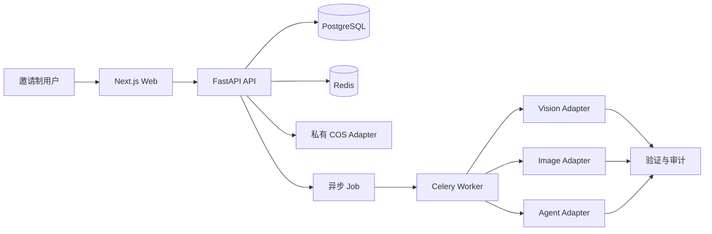
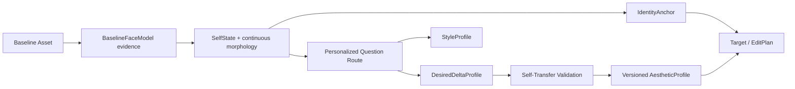
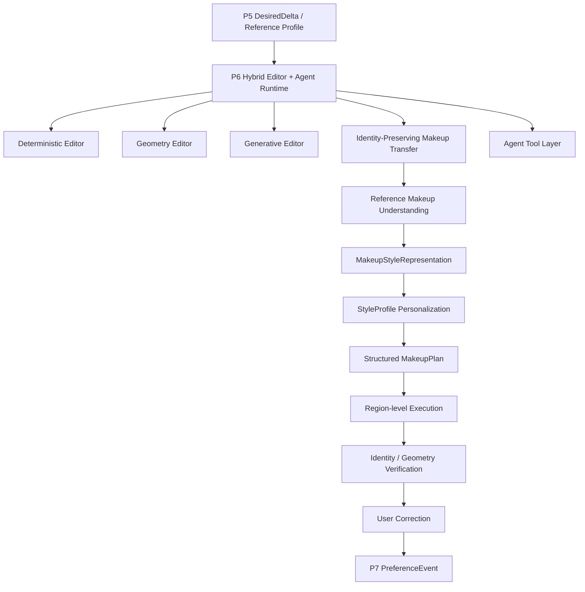
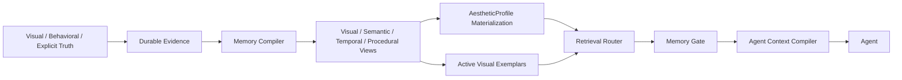

# 系统架构

## 边界

- Web 只通过版本化 API 与服务端通信，不直接访问数据库、COS 或模型供应商。
- API 负责认证授权、领域规则、幂等、事务、审计和 Job 创建。
- Worker 执行可重试任务；每次外部调用形成 ModelRun/JobAttempt，结果先验证再发布。
- PostgreSQL 是权威状态；Redis 丢失不得造成账务或 Profile 数据丢失。
- 所有供应商调用通过 Protocol/Adapter；候选实现未经验证必须抛出明确错误。

## 邀请制身份与会话（Phase 1）

- `/api/v1` 的认证边界使用中国大陆 `+86` E.164 手机号、短信 challenge、邀请码与短时 Bearer access token。新用户的 challenge 可绑定邀请码，但只有成功验证验证码、创建用户与写入 `InviteRedemption` 的同一事务才会消费邀请码；现有用户重新登录不需要邀请码。
- Access token 是带 `kid` 的短时 HS256 JWT；Web 使用不透明、可轮换的 refresh Cookie。refresh token 不能由 JavaScript 读取，刷新和 Cookie 会话撤销需经 CSRF 与 Origin 校验；reuse 会撤销整个 session family。
- 用户初始为 pending。年龄凭证与指定版本政策接受均完成后才成为 active；政策接受不等同于后续处理 facial data 前的用途级 Consent。
- `SmsProvider` 与 `AgeAssuranceProvider` 都是 Adapter 边界。手机号和一次性年龄凭证只可在必要的瞬时 Provider 调用中出现，业务持久化与日志只使用最小、不可逆的关联值。
- 生产注册取决于已验证 Provider、Redis 限流、密钥和安全/法律 Gate；缺失时必须关闭或 fail closed。Phase 1 不接入真实短信或年龄凭证供应商。

## Purpose Consent 与 Quarantine Upload Control（P1-M3）

政策接受不授权 facial-data 处理。active 用户必须对服务端配置的精确 purpose/version/policy digest/scope 创建 append-only grant，withdrawal 通过新事件引用被撤回 grant。当前有效状态由事件计算，历史不覆盖。

UploadIntent 与 append-only events 是隔离控制面，不是 Asset。对象 key 由服务端生成且不含用户标识；客户端不能提供路径、bucket 或任意 URL。M3 complete 只确认 Provider object metadata 并形成 `uploaded_unverified`，不解码、不分析、不创建 Job/Asset。授权撤回立即阻止新签名并 tombstone 未晋升 intents；已签 URL 的最大残余窗口受短 TTL 限制，迟到对象不可进入 M4 并由清理删除。

## Agent Runtime

Agent 的职责是 Understand → Plan → Call Tools → Verify → Explain → Learn。LLM 不得直接写数据库、访问 COS 或扣减额度。EditPlan 必须结构化，列出操作、参数、保持项、强度和验证条件。

## Self-conditioned personalization

`BaselineFaceModel` 是特定 analyzer 产生的测量证据；`SelfState` 是供路由和编辑使用的版本化解释。DesiredDelta 只能相对 SelfState 表达。人口先验不得提供目标几何，证据不足时保持小 delta 和高不确定性。

## 非破坏式编辑

Original Asset → EditingSession → ImageVersion DAG → EditOperation 序列 → Renderer → QA → 新 Derived Asset。Undo、Redo、Fork 和 Compare 都通过版本图实现，不覆盖原始 blob。

## P6 Hybrid Editor 能力分层（未来研究边界）

Identity-Preserving Makeup Transfer 是 P6 的一级高优先级研究轨道和能力子系统，不是 `Generative Editor` 内一个不透明的一键函数或单一 `makeup_transfer()` 工具。它必须把参考人物身份与妆容表示分离，并在 `SelfState`、`StyleProfile`、`DesiredDeltaProfile`、`IdentityConstraints`、显式锁和当前指令共同约束下生成可解释、区域化的 `MakeupPlan`。其领域边界至少覆盖参考妆容理解、供应商中立的 `MakeupStyleRepresentation`、个性化计划、区域执行、验证与用户纠正。

妆容操作与几何操作必须分域。除非 `EditPlan` 明确包含几何修改，妆容执行不得改变脸宽、下颌、眼距、眼睛大小、鼻或嘴部几何；可通过妆容实现的感知变化也不得静默改写 `DesiredDeltaProfile`。结果必须先通过身份、非目标几何、区域、纹理和伪影验证，再进入版本图。最终用户纠正可形成 `PreferenceEvent`，模型自产结果本身不能形成长期证据。

## P7 Visual Memory OS（未来方向）

P7 的权威层是用户确认且仍获授权保留的证据，不是 Profile、embedding、图或供应商记忆。用户保存的最终结果与到达该结果的 EditOperation trajectory 必须共同可追溯；未保存的 AI 生成结果没有直接长期权威。所有派生表示必须可重建、可版本化并传播删除。

检索按 geometry、makeup、skin、lighting、scene、global style、identity constraint、procedure 和 temporal history 等 facet 路由，并在进入 AgentContext 前经过同用户、授权、目的、保留、冲突、当前指令和来源可信度检查。Agent 只接收有界的任务上下文，而不是原始记忆语料。完整 provisional 方向见 `VISUAL_MEMORY_OS.md`。
