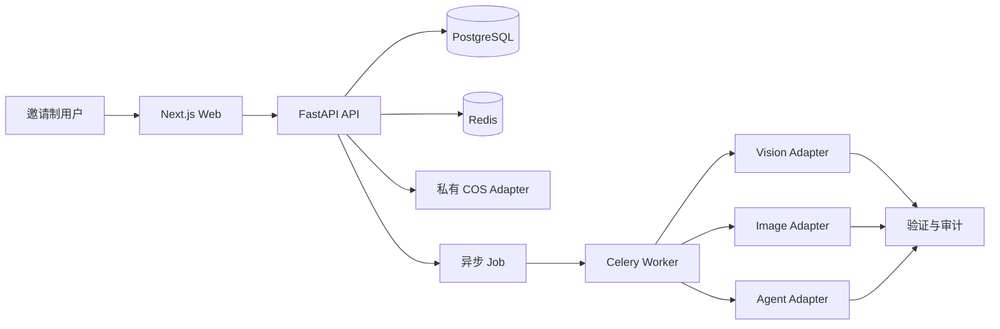
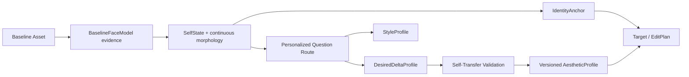

# 系统架构

## 边界

- Web 只通过版本化 API 与服务端通信，不直接访问数据库、COS 或模型供应商。
- API 负责认证授权、领域规则、幂等、事务、审计和 Job 创建。
- Worker 执行可重试任务；每次外部调用形成 ModelRun/JobAttempt，结果先验证再发布。
- PostgreSQL 是权威状态；Redis 丢失不得造成账务或 Profile 数据丢失。
- 所有供应商调用通过 Protocol/Adapter；候选实现未经验证必须抛出明确错误。

## Agent Runtime

Agent 的职责是 Understand → Plan → Call Tools → Verify → Explain → Learn。LLM 不得直接写数据库、访问 COS 或扣减额度。EditPlan 必须结构化，列出操作、参数、保持项、强度和验证条件。

## Self-conditioned personalization

`BaselineFaceModel` 是特定 analyzer 产生的测量证据；`SelfState` 是供路由和编辑使用的版本化解释。DesiredDelta 只能相对 SelfState 表达。人口先验不得提供目标几何，证据不足时保持小 delta 和高不确定性。

## 非破坏式编辑

Original Asset → EditingSession → ImageVersion DAG → EditOperation 序列 → Renderer → QA → 新 Derived Asset。Undo、Redo、Fork 和 Compare 都通过版本图实现，不覆盖原始 blob。
