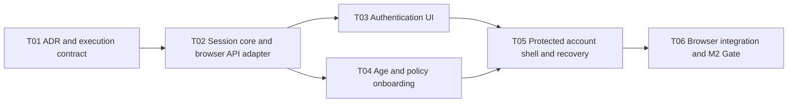

# P1-M2 Execution Protocol

## Milestone contract

- Milestone: `P1-M2 — Web Authentication and Onboarding`
- Entry baseline: frozen P1-M1 SHA `9a496df87535b6abc7d78716740eb335fc42ad2c`
- State: `EXECUTING`
- Objective: 使用生成客户端交付邀请登录、OTP、外部年龄凭证、精确政策接受、刷新恢复、退出和 active account shell。
- Non-goals: 不修改 P1-M1 领域/API 语义，不实现上传、facial processing、真实 Provider、支付、analytics 或公开注册。

本协议是 P1-M2 的 rolling-wave refinement，不重做 Master Planning。状态机、Terra 权限和 Repair Task 规则继承仓库根规则；本 Milestone 的实现缺陷编号为 `P1-M2-Rxx`。

## Public and browser boundaries

- 只消费当前生成的七个 M1 endpoint；不新增 API endpoint 或手写 DTO。
- Access token 仅驻留 Client Component 内存；refresh token 仅由 API HttpOnly Cookie 管理。
- 首次加载和完整刷新通过 refresh bootstrap 恢复；失败进入 anonymous，不泄露旧账户内容。
- pending flow 以 `/users/me` 的 `onboarding_requirements` 为权威，不根据页面步骤猜测激活状态。
- 年龄 callback 与政策 manifest 遵守 ADR-017；未配置时 UI 明确阻断，不伪造成功。
- Web 默认简体中文并保留语义化 HTML、键盘路径、focus 管理和可读错误。

## Bounded task DAG

## P1-M2-T01 — Freeze Web security and state decisions

- Scope: ADR-017、本协议、MILESTONES/MEMORY 状态。
- Acceptance: access/refresh、CSRF、idempotency、age callback、policy manifest、route boundary 与 E2E 语义不再留给实现任务自行选择。
- Forbidden: production code、依赖、M1 API/schema。

## P1-M2-T02 — Session core and generated browser API adapter

- Scope: `apps/web/src/lib/auth/**`、Web public/server config、对应 unit tests。
- Deliverables: generated-client wrapper、memory session store、refresh single-flight、CSRF reader、idempotency lifecycle、sanitized stable errors、production config fail-closed。
- Tests: state transitions、401 once-only replay、refresh concurrency、Cookie/Origin headers、Storage prohibition、sensitive error redaction、config negatives。
- Forbidden: UI pages、API changes、Provider SDK、token persistence。

## P1-M2-T03 — Accessible authentication UI

- Scope: auth/join routes、认证 components、必要的 `@mirror/ui` primitives、组件测试。
- Deliverables: phone/invite、OTP、loading/rate-limit/generic error、restart flow；既有用户邀请码可选。
- Tests: label/description/error association、keyboard submit、focus transfer、double-submit prevention、no account enumeration copy、no sensitive DOM persistence after step transition。
- Parallelization: T02 后可与 T04 并行；独占 auth presentation files。

## P1-M2-T04 — External age and exact policy onboarding

- Scope: onboarding lib/components、server-validated public metadata、对应 tests。
- Deliverables: strict popup bridge、timeout/close/retry、manifest rendering、逐项确认、精确版本提交、activation refresh。
- Tests: origin/source/state/schema rejection、credential disposal、draft/missing manifest fail-closed、precise policy payload and required-step routing。
- Forbidden: real Provider SDK、手输 credential、legal text approval、M1 API changes。

## P1-M2-T05 — Protected account shell and session recovery

- Scope: session provider integration、protected shell、logout/recovery/error boundaries。
- Deliverables: bootstrap skeleton、anonymous redirect、pending resume、active shell、refresh recovery、logout Cookie clearing behavior and no unauthorized content flash。
- Tests: complete reload, stale pending access activation recovery, revoked/expired session, network failure, logout and multi-request refresh single-flight。

## P1-M2-T06 — Browser integration and M2 Gate

- Scope: browser E2E harness、security/contract tests、acceptance evidence；缺陷只上报 Repair Task。
- Required evidence: real production Next build + browser; deterministic Fake API/age bridge; generated contract; Python/TS full suite; Docker/Compose; dependency/license audit; Gitleaks; complete GitHub Actions on one SHA。
- Browser scenarios: new invited flow、existing login、OTP/error recovery、pending age/policy、refresh reload、CSRF failure、active shell、logout、unauthorized navigation、no sensitive storage/URL/log。
- Gate: zero mandatory skip; Principal alone declares `P1-M2: PASS`, closure CI 后才 `FROZEN`。

## Entry and exit criteria

Entry:

- P1-M1 is FROZEN and its API/OpenAPI is unchanged.
- Branch `codex/phase1-m2-web-onboarding` starts at the frozen SHA.
- No real phone, credential, Provider key or facial image is used.

Exit:

- All T01–T06 are Principal-accepted.
- Refresh reload, logout, pending/active gating and browser accessibility are proven.
- Access/refresh/OTP/phone/invite/age credential are absent from persistent browser storage, URL and logs.
- OpenAPI/generated client is unchanged or regenerated from an explicitly approved API change; P1-M2 expects no API change.
- Complete remote CI and browser Gate are green on the same SHA.
