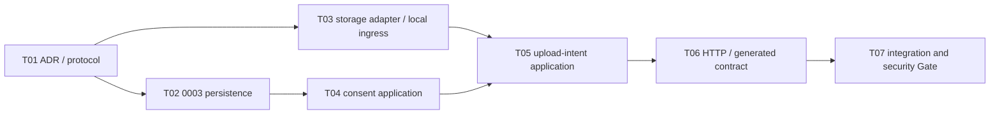

# P1-M3 Execution Protocol

## Milestone contract

- Milestone: `P1-M3 — Purpose Consent, Authorization and Private Upload Control Plane`
- Entry baseline: frozen P1-M2 SHA `aef81b1ec862b20138cf974da320640c7168b8b1`
- State: `EXECUTING`
- Objective: 建立用途级 facial-data Consent、owner-bound quarantine UploadIntent、短时私有 upload grant、complete/cancel 与访问审计闭环。
- Non-goals: 不创建 Original Asset，不解码图片，不读取 EXIF，不做人脸/landmark/AI 分析，不接真实 COS，不处理真人 fixture，不进入 M4。

本协议是 P1-M3 rolling-wave refinement。状态机、Principal/Terra 权限、OSS change control 和 Repair Task 规则继承根规则；计划外实现缺陷编号为 `P1-M3-Rxx`。

## Bounded task DAG

## P1-M3-T01 — Freeze consent and quarantine control semantics

- Scope: ADR-018、本协议、SYSTEM/DATA/THREAT/RETENTION/IDEMPOTENCY 与 Milestone state。
- Acceptance: consent purpose/version/scope、withdrawal、UploadIntent state、one-time URL、ownership、Local ingress、M4 boundary 和残余 URL TTL 不再留给实现任务选择。
- Forbidden: production code、migration、Provider dependency、真实数据。

## P1-M3-T02 — Add `0003` consent and upload-control persistence

- Scope: ConsentRecord forward additions、UploadIntent、UploadIntentEvent、Alembic `0003` 与 PostgreSQL tests。
- Requirements: 不改 `0001/0002`；consent/event append-only；grant/withdraw linkage、owner/consent FK、opaque object key uniqueness、declared metadata bounds、state timestamps 和并发约束由 PostgreSQL 实证。
- Validation: `0001 → 0002 → 0003 → 0002 → 0003`、`alembic check`、真实 PostgreSQL invariant/concurrency tests、Ruff/mypy。
- Collision domain: `models.py`、migration versions、database invariants。

## P1-M3-T03 — Extend storage Adapter and implement Local quarantine ingress

- Scope: Provider-neutral upload grant/metadata/delete types、Local adapter、disabled Tencent boundary、adapter-only local PUT route与 tests。
- Requirements: CSPRNG opaque key/token、fixed root containment、private write-only path、TTL、declared byte/MIME/checksum constraints、bounded streaming、atomic temp-to-quarantine move、idempotent delete；不得提供任意 URL fetch 或 GET。
- Security: production rejects Local; test/CI zero external calls; logs/errors redact URL/token/key/bytes。
- Validation: protocol/type tests、path traversal/symlink、oversize/short body、MIME/checksum mismatch、expiry/replay、delete、source scan。

## P1-M3-T04 — Implement purpose-consent application services

- Scope: consent repository/UoW/service、current-state resolution、grant/withdraw/list、audit and tests。
- Requirements: active actor、exact configured definition、append-only idempotency、withdraw exact active grant、concurrent duplicate/conflict handling、withdrawal cancellation hook；政策 acceptance 不能替代 purpose consent。
- Validation: unit + real PostgreSQL idempotency/concurrency/append-only/withdrawal tests、log redaction。

## P1-M3-T05 — Implement owner-bound upload-intent services

- Scope: upload repository/UoW/service、storage port、rate/quota port、intent lifecycle and tests。
- Requirements: valid consent in same transaction boundary、server-generated key、one signed grant、same-owner SQL predicates、complete against Provider metadata、cancel/delete、late upload tombstone、no Asset/Job creation。
- Validation: unit + PostgreSQL/provider integration、horizontal access、idempotency/conflict、expiry、complete/cancel/withdraw races、storage failure recovery。

## P1-M3-T06 — Expose API and regenerate TypeScript contract

- Scope: consent/assets routers、strict Pydantic schemas、dependency wiring、OpenAPI/generated TS、HTTP tests；删除旧 `/assets` 501 stub only after real M3 route is wired。
- Requirements: ADR-018 的七个接口与状态码、Bearer active scope、Idempotency-Key、stable errors、URL only in create response、SecretStr where relevant、no business logic in routers。
- Validation: API positive/negative/ownership/response leak tests、OpenAPI export、contracts generate/check/typecheck。

## P1-M3-T07 — Execute M3 integration and security Gate

- Scope: independent integration/security/contract evidence；缺陷只上报 `P1-M3-Rxx`。
- Required evidence: fresh/existing PostgreSQL migration、real Redis/Celery regression、Local ingress with synthetic non-face fixture、withdrawal/late upload, horizontal access, path traversal, metadata limits, logs, production fail-closed, full Python/TS/Docker/Gitleaks/GitHub Actions。
- Gate: zero mandatory skip；Principal 先宣告 PASS，acceptance closure CI 后才 FROZEN。

## Entry and exit criteria

Entry:

- P1-M2 is FROZEN at `aef81b1ec862b20138cf974da320640c7168b8b1` with run `31893106522` green.
- Branch `codex/phase1-m3-upload-control` starts from that exact SHA.
- Only synthetic/non-face fixtures are available; no COS/SMS/AI/payment credential is provided.

Exit:

- T01–T07 are Principal-accepted and `0003` lifecycle has real PostgreSQL evidence.
- No path permits pending/unconsented/cross-user signing, URL replay after expiry, arbitrary key/URL, public read or ingress-to-Original shortcut.
- Withdrawal prevents new signing and tombstones late objects; Local storage remains nonproduction only.
- OpenAPI/generated TypeScript is synchronized and complete remote CI is green on one SHA.
