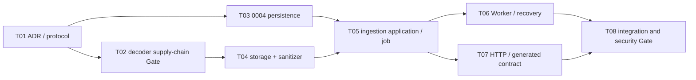

# P1-M4 Execution Protocol

## Milestone contract

- Milestone: `P1-M4 — Safe Image Ingestion and Asset Lifecycle`
- Entry baseline: frozen P1-M3 SHA `f6da0101aa7ac87479380b1dae9b4f0361a6b406`
- State: `EXECUTING`
- Objective: 将 owner-bound `uploaded_unverified` quarantine object 经异步、可重试、安全解码与 canonical re-encode 晋升为不可变 Original Asset。
- Non-goals: 不处理真人 fixture，不接真实 COS，不提供 Asset 下载/列表/删除 UI，不做人脸检测、landmark、质量评分、Vision/AI 调用，不进入 P1-M5。

本协议是 P1-M4 rolling-wave refinement。状态机、Principal/Terra 权限、OSS change control 和 Repair Task 规则继承根规则；计划外实现缺陷编号为 `P1-M4-Rxx`。任何 decoder 替换、格式策略、像素几何变化、生产 real-image 开关或 Job 权威语义变化必须走 Principal change control，不能包装成 Repair Task。

## Bounded task DAG

## P1-M4-T01 — Freeze ingestion and promotion semantics

- Scope: ADR-019、本协议、SYSTEM/DATA/THREAT/RETENTION/MILESTONES/MEMORY。
- Acceptance: async boundary、canonical format、limits、metadata policy、Job authority、recheck、promotion point、failure recovery、cleanup 和 M5 boundary 不再留给实现任务选择。
- Forbidden: production code、migration、依赖安装、图片 fixture、真实数据。

## P1-M4-T02 — Evaluate and approve the decoder supply chain

- Scope: Pillow 精确 release 的官方来源、包内 LICENSE、传递依赖、wheel/platform、编译 feature、漏洞与维护证据；新增独立 adoption record。
- Requirements: 只研究候选，不接受远端条款、不下载模型/权重/数据集；锁定版本前运行干净 Python 3.13 安装、`pip-audit`、license/SBOM 和 decoder feature inventory。
- Gate: Terra 只能报告 `THIRD_PARTY_CANDIDATE_FOUND`；Principal 独立复核后才可给出 `THIRD_PARTY_APPROVED`。未批准时 T04 及以后保持 BLOCKED。
- Collision domain: Python manifests/lock、供应链文档；不得实现 sanitizer。

## P1-M4-T03 — Add `0004` ingestion persistence

- Scope: forward-only `0004_safe_image_ingestion`、Job/JobAttempt ownership and lifecycle、UploadIntent processing/final/retention fields、append-only `AssetIngestionRecord`、PostgreSQL tests。
- Requirements: 不改 `0001/0002/0003`；one intent/one job/one final record/one promoted Asset；promoted/rejected shape、owner lineage、timestamps、stable codes、Asset immutability 和 final evidence append-only 由数据库约束。
- Validation: `0001 → 0002 → 0003 → 0004 → 0003 → 0004`、`alembic check`、真实 PostgreSQL invariant/concurrency tests、Ruff/mypy。
- Collision domain: `models.py`、migration versions、database invariants。

## P1-M4-T04 — Extend storage Adapter and implement the pure sanitizer

- Preconditions: T02 `THIRD_PARTY_APPROVED`。
- Scope: bounded quarantine read、sanitized create-if-absent/inspect/delete、Local shared storage、pure image sanitizer、config and tests。
- Requirements: exact magic/format/MIME、single frame、byte/edge/pixel limits、decompression-bomb handling、EXIF transpose、ICC 不解析、metadata removal、assumed-sRGB RGB/white alpha、versioned deterministic JPEG encoding、output re-decode/hash/limits；不访问数据库、Celery、HTTP 或外部网络。
- Security: no arbitrary URL/path/shell；bounded spooling and cleanup；decoder error allowlist；production Local/facial intake remains disabled。
- Validation: generated non-face fixtures、malformed/truncated/animation/polyglot/bomb、metadata absence、repeatability、storage symlink/overwrite/orphan behavior、Ruff/mypy、dependency audit。
- Collision domain: providers/storage、sanitizer/config、Python lock/manifests。

## P1-M4-T05 — Implement ingestion application services and authoritative Jobs

- Scope: ingestion repository/UoW/service、idempotent Job creation/status、claim/lease/finalize/reconcile、audit and PostgreSQL tests。
- Requirements: owner + active + exact Consent recheck；one Job per intent；purpose-separated idempotency；DB Job authoritative；dispatch failure leaves recoverable pending state；promotion transaction creates one Asset and final evidence；stable rejection taxonomy。
- Security: Job payload excludes object key/bytes；all user reads owner-bound in SQL；withdrawal/freeze/delete/expiry blocks read or final promotion。
- Validation: unit + real PostgreSQL concurrency、idempotency conflict/replay、claim/lease/stale、double promotion、withdraw races、DB/object failure matrix。
- Collision domain: ingestion application/repository/UoW and tests；不得实现 HTTP/Celery adapter。

## P1-M4-T06 — Wire Worker execution, retry and cleanup recovery

- Scope: shared task envelope/dispatcher boundary、Celery ingestion task、Local development runner、pending/stale reconciler、quarantine/orphan cleanup、Worker tests and Compose shared private storage。
- Requirements: at-least-once safe；task message only references job ID；late ack、worker-lost retry、bounded retry/backoff、stable deterministic rejection versus transient failure；cleanup idempotent；domain logic remains independent of Celery。
- Security: dedicated ingestion queue/resource limits where supported；no external Provider/network；logs use job/request IDs only。
- Validation: real Redis/Celery dispatch、duplicate delivery、worker crash/stale lease、dispatch outage recovery、post-commit cleanup failure、inspect ping and LocalTaskRunner Windows behavior。
- Collision domain: worker/tasks/Compose；不得 expose HTTP。

## P1-M4-T07 — Expose ingestion Job API and regenerate TypeScript contract

- Scope: two ADR-019 endpoints、strict schemas/dependencies、OpenAPI/generated TypeScript、HTTP/contract tests。
- Requirements: `202 JobAccepted` + owner-bound status；Idempotency-Key；stable errors；no business logic in router；response never exposes key/path/raw decoder/provider data；existing M3 endpoints remain compatible。
- Validation: HTTP positive/negative/ownership/consent/disabled/idempotency tests、OpenAPI export、contracts generate/check/typecheck/Vitest。
- Collision domain: routers/schemas/wiring/generated contracts。

## P1-M4-T08 — Execute M4 integration and security Gate

- Scope: independent integration/security/contract evidence；缺陷只上报 `P1-M4-Rxx`。
- Required evidence: fresh/existing PostgreSQL migration、real Redis/Celery and crash recovery、generated safe/malicious fixture matrix、metadata stripping、no raw-to-Asset path、withdrawal race、horizontal access、TTL/orphan cleanup、production fail-closed、full Python/TS/Docker/Gitleaks/GitHub Actions。
- Gate: zero mandatory skip；同一 candidate SHA 上全绿。Principal 先宣告 PASS，acceptance closure CI 后才 FROZEN。

## Entry and exit criteria

Entry:

- P1-M3 is FROZEN at `f6da0101aa7ac87479380b1dae9b4f0361a6b406` with run `31898073537` green.
- Branch `codex/phase1-m4-safe-ingestion` starts from that exact SHA.
- Only generated synthetic/non-face fixtures are permitted; no COS/AI/payment credential or real user image is provided.
- Decoder implementation cannot begin before T02 receives Principal `THIRD_PARTY_APPROVED`.

Exit:

- T01–T08 are Principal-accepted and `0004` lifecycle has real PostgreSQL evidence.
- No path promotes raw, mismatched, animated, malformed, oversized, metadata-bearing, unauthorized, withdrawn, expired or cross-user content.
- Repeat delivery and every object/DB/dispatch crash point produce at most one immutable Original Asset and recoverable cleanup evidence.
- OpenAPI/generated TypeScript is synchronized and complete remote CI is green on one SHA.
