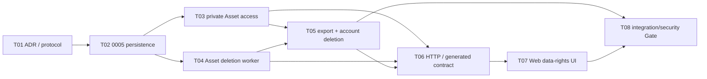

# P1-M5 Execution Protocol

## Milestone contract

- Milestone: `P1-M5 — Asset Access, User Data Rights and Lifecycle UI`
- Entry baseline: frozen P1-M4 SHA `79f50bdcf2192a7df4a511de82fcb221d194a6da`
- State: `EXECUTING`
- Objective: provide owner-bound Asset access, asynchronous deletion, data export, account deletion propagation and the corresponding Web controls.
- Non-goals: no real face fixture, COS/AI/payment call, face analysis, Profile/Questionnaire/Edit data, public bucket, admin Web UI or P1-M6 implementation.

This protocol is the P1-M5 rolling-wave refinement. State, Principal/Terra authority, OSS change control and Repair Task rules inherit the root policy; unplanned implementation defects use `P1-M5-Rxx`. Changes to deletion authority, recovery, retention, export contents, audit retention or immutable Original semantics require Principal change control.

## Bounded task DAG

## P1-M5-T01 — Freeze data-rights and lifecycle semantics

- Scope: ADR-020, this protocol, RETENTION/THREAT/DATA_MODEL/MILESTONES/MEMORY.
- Acceptance: ownership, grant, audit, deletion authority, export contents, account freeze, propagation, recovery and M6 boundary are no longer left to implementation tasks.
- Forbidden: production code, migration, generated contracts, real data or external Provider.

## P1-M5-T02 — Add `0005` lifecycle persistence

- Scope: forward-only `0005_data_rights_lifecycle`, SQLAlchemy models and PostgreSQL invariant tests.
- Requirements: append-only AssetDeletionRequest/Event, DataExportRequest/Event, AccountDeletionRequest/Event and ObjectDeletionEvidence; owner lineage, one active request, job reference, terminal shape and retention constraints; append-only AssetAccessAudit; account/Asset tombstone projections.
- Validation: `0001 → … → 0005 → 0004 → 0005`, `alembic check`, real PostgreSQL uniqueness/concurrency/append-only tests, Ruff/mypy.
- Collision domain: models, migration versions and DB invariant tests only.

## P1-M5-T03 — Implement private Asset access

- Scope: exact-key download grant Adapter, Local loopback synthetic implementation, owner-bound repository/service and audit.
- Requirements: active owner and nondeleted Asset in SQL; short-lived one-time grant; no stable/public URL, storage key, token or bytes in logs/responses; grant redemption audit without secret material.
- Validation: ownership, deleted/frozen user, expiry/replay, path/symlink, private-storage and production fail-closed tests.
- Collision domain: storage Provider, Asset access application and focused tests.

## P1-M5-T04 — Implement Asset deletion and Worker cleanup

- Scope: Asset deletion service, reference-only task, Celery/Local adapter, retry/reconcile and physical-deletion evidence.
- Requirements: idempotent request admission immediately blocks access/work; at-least-once deletion; no false completion; dependency-aware variant handling; object missing is stable idempotent success only when authoritative metadata matches the request.
- Validation: duplicate/race, active download, Worker crash, storage failure, already-missing object, variant dependency and horizontal-access tests with real PostgreSQL/Redis.
- Collision domain: Asset deletion application/Worker and tests; no export/UI.

## P1-M5-T05 — Implement export and account-deletion propagation

- Scope: deterministic private export archive, short retention cleanup, account freeze/session revoke, current Phase 1 propagation and completion evidence.
- Requirements: explicit export schema/categories, safe archive paths, no raw quarantine/secrets/internal risk data; deletion atomically freezes user and sessions before dispatch; Consent/upload/ingestion/Asset/export propagation is idempotent and blocks new work.
- Validation: archive isolation, cross-user exclusion, retention expiry, repeated job, account race, session revoke, pending work, storage/database faults and de-identification tests.
- Collision domain: export/account application/Worker and tests.

## P1-M5-T06 — Expose `/api/v1` rights APIs and regenerate contracts

- Scope: ADR-020 endpoints, strict schemas/dependencies, OpenAPI/generated TypeScript and HTTP/contract tests.
- Requirements: business logic remains in application services; Idempotency-Key and stable errors; owner-bound reads; asynchronous `job_id`; no key/hash/token/internal evidence exposure.
- Validation: positive/negative/ownership/state/idempotency/Cookie scope, OpenAPI export, generation/drift/typecheck/Vitest.
- Collision domain: routers, schemas, wiring and generated contracts.

## P1-M5-T07 — Implement Web Asset and data-rights controls

- Scope: authenticated Asset list/detail/download/delete, export request/status/download and guarded account deletion confirmation.
- Requirements: generated client only; access token remains memory-only; no URL/token/phone in analytics or persistent browser storage; deletion actions explain irreversibility and real status without fake completion.
- Validation: components, accessibility, refresh recovery, failure/retry and real browser E2E against deterministic Fake API.
- Collision domain: Web/UI/E2E only.

## P1-M5-T08 — Execute M5 integration and security Gate

- Scope: independent integration/security/contract evidence; defects only reported as `P1-M5-Rxx`.
- Required evidence: fresh/existing PostgreSQL migration, Redis/Celery retry, private download, horizontal access, deletion races, export isolation/expiry, account freeze/propagation, production fail-closed, full Python/TS/browser/Docker/Gitleaks/GitHub Actions.
- Gate: zero mandatory skip on one candidate SHA. Principal declares PASS; acceptance closure CI is required before FROZEN.

## Entry and exit criteria

Entry:

- P1-M4 is FROZEN at `79f50bdcf2192a7df4a511de82fcb221d194a6da` with run `31904693236` green.
- Branch `codex/phase1-m5-data-rights` starts from that exact SHA.
- Only generated synthetic/non-face fixtures are permitted; production real-image access remains disabled.

Exit:

- T01–T08 are Principal-accepted and `0005` lifecycle has real PostgreSQL evidence.
- No cross-user, public, stable or post-tombstone Asset access path exists.
- Asset/account deletion stops new work immediately and produces truthful, retryable physical-deletion evidence.
- Export archives are owner-isolated, short-lived, auditable and free of excluded secrets/internal data.
- OpenAPI/generated TypeScript and Web behavior are synchronized; complete remote CI is green on one SHA.
