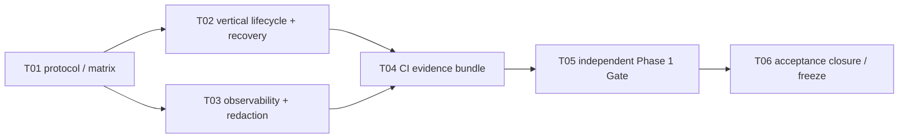

# P1-M6 Execution Protocol

## Milestone contract

- Milestone: `P1-M6 — Application Foundation Integration Gate`
- Entry baseline: frozen P1-M5 SHA `d8c39ae95829e6401cc4379656f210362352e717`
- State: `EXECUTING`
- Objective: independently prove that P1-M1 through P1-M5 form one secure, recoverable and observable Application Foundation, then close and freeze Phase 1.
- Non-goals: no new product capability, migration, public endpoint, real face/phone/age credential, real Provider, production deployment, payment, questionnaire, Profile, AI analysis/editing or P2 implementation.

This protocol is the P1-M6 rolling-wave refinement. State, Principal/Terra authority, OSS change control and Repair Task rules inherit the root policy; unplanned implementation defects use `P1-M6-Rxx`. M6 may add tests, test-only orchestration, standard-library observability instrumentation, CI evidence and operations/security documentation. Any new domain state, public contract, dependency or production Provider requires separate Principal change control and is not an M6 repair.

## Bounded task DAG

## P1-M6-T01 — Freeze the integrated acceptance matrix

- Scope: this protocol, `ACCEPTANCE.md`, `MILESTONES.md`, `MEMORY.md` and current-stage headers.
- Requirements: bind every Phase 1 claim to an evidence source; distinguish engineering PASS from deferred legal/Provider/production Gates; define zero mandatory skip and same-SHA remote evidence.
- Validation: documentation format, accepted-ADR conflict scan, frozen-tag/SHA read-only checks and Git hygiene.
- Forbidden: production code, migration, generated contracts, dependency or Phase 2 planning/implementation.

## P1-M6-T02 — Execute the vertical lifecycle and recovery drill

- Scope: integration/security tests and test-only fixtures for the existing M1–M5 public/application boundaries.
- Requirements: prove invited authentication and activation, purpose Consent, quarantine upload, safe ingestion, private Asset access, export, Asset deletion and account deletion as one owner-bound lifecycle; inject broker/storage/transaction interruption at existing recovery boundaries and verify idempotent reconciliation, truthful completion and immediate authorization denial.
- Security: synthetic/non-face bytes only; no real phone, credential, signed URL, object key or token may enter committed fixtures, logs or failure output.
- Validation: real PostgreSQL and Redis; real Celery dispatch/round trip where applicable; no SQLite/Mock DB substitution; no mandatory skip.
- Forbidden: new business rules, endpoint/schema changes, migration, production Provider or UI feature.

## P1-M6-T03 — Close the basic observability and redaction Gate

- Scope: standard-library structured operational events, request/job correlation, deterministic capture tests and an operations runbook.
- Requirements: emit bounded event names, result codes, duration and request/job/session-family identifiers needed for challenge/rate-limit/session/Consent/upload/ingestion/access/export/deletion operations; collectors must be able to derive counts and latency without sensitive payloads. Define alert conditions and investigation links without claiming a production backend is deployed.
- Security: strict field allowlist; never emit phone/OTP/invite/access or refresh token, credential, signed URL, object key, image bytes/metadata, Provider payload or prompt. Local grant handles must be redacted before access logging.
- Validation: capture tests for success/failure/retry paths, recursive redaction negatives, request/job correlation and source scan; existing behavior and public contracts remain unchanged.
- Forbidden: new third-party telemetry dependency, external network call, sensitive high-cardinality value, admin endpoint or production alerting claim.

## P1-M6-T04 — Produce machine-readable CI evidence

- Scope: `.github/workflows/ci.yml`, test-only scripts/config and artifact documentation.
- Requirements: retain existing full Python/TypeScript/browser/Docker/Gitleaks Gates; add an explicit Phase 1 integration/recovery assertion and machine-readable evidence that binds test output, migration head, OpenAPI digest and commit SHA. Evidence generation must fail closed if required files or commands are missing.
- Security: artifacts must exclude environment dumps, database dumps, credentials, signed URLs, raw quarantine, Asset bytes and Provider payloads.
- Validation: local generation, schema/content negative tests, workflow syntax/model review and remote artifact download/readability.
- Forbidden: weakening existing jobs, `continue-on-error`, mandatory skip, external service, release/deploy step or secrets in workflow values.

## P1-M6-T05 — Execute the independent Phase 1 candidate Gate

- Scope: complete integrated validation and defect reporting only.
- Required evidence: fresh PostgreSQL migration to `0007`, downgrade/re-upgrade/check, Redis/Celery, full API/Worker, `pnpm check`, real browser flows, vertical lifecycle/recovery, observability/redaction, OpenAPI regeneration drift, dependency/license/SBOM, Docker/Compose, full-history and exact-index Gitleaks.
- Gate: all required evidence must pass on one candidate SHA; each remote job and artifact must be inspected. A defect becomes the smallest `P1-M6-Rxx`; an architectural change stops for change control.
- Forbidden: changing business behavior to satisfy a test, skipping a Gate, real data/Provider or declaring Phase 1 frozen.

## P1-M6-T06 — Record acceptance and freeze Phase 1

- Scope: `PHASE1_FINAL_AUDIT.md`, `P1_M6_ACCEPTANCE.md`, Milestones/current-stage headers and `MEMORY.md`.
- Requirements: candidate run first yields `P1-M6: PASS_AWAITING_CLOSURE`; the acceptance record's own commit must repeat the complete remote Gate before P1-M6 and Phase 1 become `FROZEN`. A final state commit is also CI-verified without creating an evidence-update loop.
- Forbidden: P2 branch, P2 tasks, deployment, Release, tag or public registration unless separately authorized after Phase 1 freeze.

## Integrated evidence matrix

| Capability                     | Authoritative evidence                                  | M6 cross-check                                                               |
| ------------------------------ | ------------------------------------------------------- | ---------------------------------------------------------------------------- |
| Invite/auth/session/age/policy | P1-M1 acceptance, PostgreSQL/Redis and HTTP tests       | activation, refresh reuse, logout and account-freeze interaction             |
| Web onboarding                 | P1-M2 acceptance, generated contract and browser suite  | refresh recovery, protected-content suppression and storage scan             |
| Consent/upload control         | P1-M3 acceptance, `0003`, Local private ingress tests   | withdrawal and late-upload denial across ingestion/deletion                  |
| Safe ingestion                 | P1-M4 acceptance, `0004`, sanitizer and Worker recovery | one immutable Original, crash/retry and raw cleanup                          |
| Asset/data rights              | P1-M5 acceptance, `0005`–`0007`, Web/API/Worker tests   | owner access, export isolation, deletion propagation and completion evidence |
| Production safety              | config negatives and Provider candidates                | registration/sensitive processing/Local/Mock remain fail closed              |
| Observability                  | request ID, AuditLog, Worker logs and T03 events        | correlation, field allowlist, counts/latency derivability and alert runbook  |
| Supply chain                   | lockfiles, adoption records, audits, SBOM and Gitleaks  | same-SHA remote evidence and readable artifacts                              |

## Entry and exit criteria

Entry:

- P1-M5 is frozen at `d8c39ae95829e6401cc4379656f210362352e717` with run `31921975223` green.
- Branch `codex/phase1-m6-integration-gate` starts from that exact SHA.
- No real data or external Provider is required or permitted.

Exit:

- T01–T05 are Principal-accepted and the candidate SHA has zero mandatory skip.
- Cross-Milestone lifecycle, recovery, authorization, deletion and observability claims have real PostgreSQL/Redis/Celery/browser/container evidence.
- Candidate, acceptance closure and final state commits each complete all three remote jobs with readable, unexpired artifacts.
- P1-M6 and Phase 1 are marked `FROZEN`; legal, Provider, PIPIA, production infrastructure and real-data Gates remain explicitly deferred.

`P1-M6_PLANNING_GATE: PASS`
