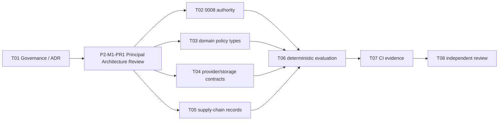

# P2-M1 Execution Protocol

## Milestone contract

- Milestone: `P2-M1 — Domain, Provenance, Governance and Research Baseline`
- Entry baseline: Phase 1 frozen final fix `fb0d6a4b67494d32b865d0eb170f43232c68efb9`
- State: `EXECUTING`
- Authority: `ENCODE_APPROVED_DECISIONS_ONLY`
- Objective: freeze P2 authority, provenance, lifecycle, typed boundaries, QA/supply-chain governance and research protocol before any synthetic generation.
- Non-goals: generation batch, image normalization, Vision model, geometry transform, QuestionBank release, public API, model download, new dependency, real Provider, real facial data or P3 implementation.

## Bounded task order

`P2-M1-PR1` is mandatory. Only `PRINCIPAL_ARCHITECTURE_REVIEW: PASS` unlocks T02–T05.

## Frozen decisions

- `SyntheticIdentity` is bank-independent; QuestionBank membership will be immutable manifest membership.
- raw, normalized, variant and released evidence layers are distinct; raw is never an Asset.
- `0008_synthetic_dataset_foundation.py` uses revision ID `0008_synth_dataset_foundation` to fit the existing Alembic 32-character version column; it only adds `SyntheticGenerationPolicy`, `SyntheticPromptTemplate`, `SyntheticQAPolicy`, `GeometryOntologyVersion`, identity decoupling and synthetic Asset invariants.
- M1 authority records are immutable from creation and only transition `DRAFT → APPROVED`; `APPROVED` is terminal and revision requires a new version.
- Provider, Vision and synthetic storage capability remains adapter-mediated, typed, deterministic in CI and fail closed when unverified.
- automatic QA hard gates cannot be bypassed; adult policy is clearly-adult synthetic presentation plus required review, never age estimation.
- P2 uses a future restricted CLI/application service and adds no public API in M1.
- Pillow 12.3.0 is scope-approved without a version change; MediaPipe, OpenCV and imagededup remain unavailable for M1.
- ADR-024 fixes the first coverage direction as China-market-first, East-Asian-presenting,
  synthetic-only and continuous-morphology-based. It prohibits real-user sensitive-group inference,
  scraped portraits and identity reproduction. P2-M1 records this as governance/domain contract
  only; coverage/style/reference concepts do not add tables, APIs, dependencies, assets or a new
  bounded task.

## Repair and change control

Unexpected implementation defects use the smallest `P2-M1-Rxx` task with root cause, bounded files, validation and regression evidence. Architecture, privacy, license, model, public-contract or Phase-boundary changes are not repairs: stop with `STATUS: BLOCKED` and `ESCALATE_TO: PRINCIPAL_SOL_HIGH`. Terra PASS is evidence only; the Principal accepts tasks and decides the milestone Gate.

## Required evidence

- real PostgreSQL `0007 → 0008 → 0007 → 0008` plus `alembic check`;
- policy/ontology digest and state tests; provider mock/zero-network/fail-closed tests; source and dependency/model scans;
- unchanged OpenAPI/generated TypeScript; full local and same-SHA three-job remote CI evidence;
- no mandatory skip, real data, external generation or model artifact.

`P2_M1_EXECUTION_GATE: EXECUTING`

Principal review evidence is recorded in `P2_M1_PR1_REVIEW.md`.
