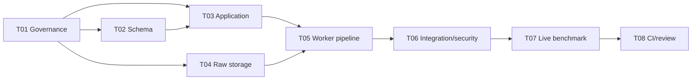

# P2-M2 Execution Protocol

## Authority and status

- Milestone: `P2-M2 — Generation Batch and Provider Pipeline`
- Entry baseline: P2-M1 frozen SHA `4a69f93f0d092afa0b520bbfb6e7d192e0f3dff1`
- State: `EXECUTING`
- Branch: `codex/phase2-m2-generation-pipeline`
- Authority: ADR-021, ADR-022, ADR-023, ADR-024 and ADR-025
- Public API impact: none
- Dependency/model/live-call impact at entry: none

## Objective and non-goals

Deliver a recoverable synthetic-only generation batch pipeline with PostgreSQL-authoritative
batch/item state, bounded cost, reference-only Worker tasks, private raw storage, deterministic
Mock execution and complete provenance. M2 does not normalize images, create Asset or
SyntheticIdentity records, run Vision/QA, generate variants, release QuestionBank content, expose a
public/internal HTTP API, add a management CLI, or authorize real-user facial processing.

## Frozen implementation contract

- `0009_generation_batch_pipeline` is the only planned migration and must not alter `0001`–`0008`.
- Batch configuration is immutable and pins approved policy/prompt plus Provider/model/version and
  pricing/output/budget/retry/concurrency snapshots.
- Item terminal outcomes distinguish `RAW_STORED`, `GENERATION_FAILED` and `CANCELLED`; QA
  `REJECTED` remains M3 semantics.
- Job/JobAttempt are execution envelopes only. P2 authority never lives in arbitrary Job payload.
- task messages contain only opaque references and schema version.
- Prompt plaintext exists only as a bounded ephemeral value inside the leased Worker execution and
  is redacted from representation/errors/logs.
- raw storage is `internal-synthetic-raw/v1`, private and separate from user and normalized Asset
  namespaces. Source metadata remains immutable after physical cleanup; deletion evidence appends.
- budget and dispatch concurrency are enforced under PostgreSQL locks. Retry cannot change a
  pinned batch version or exceed item/batch ceilings.
- CI uses deterministic Mock and zero network. No real Provider is production-approved by M2
  implementation alone.

## Bounded tasks

All task reports use:

`TASK_ID; STATUS: PASS|BLOCKED|FAIL; SUMMARY; FILES_CHANGED; TESTS_RUN; TEST_RESULTS; ACCEPTANCE_CRITERIA; SECURITY_NOTES; DATA_NOTES; OSS_LICENSE_NOTES; ASSUMPTIONS; BLOCKERS; RISKS_FOUND; HANDOFF_NOTES`

### P2-M2-T01 — Freeze M2 authority and execution protocol

- Scope: ADR-025, M2 protocol/acceptance skeleton, architecture/Milestone/AGENTS/MEMORY forward state.
- Forbidden: production code, migration, dependencies, Provider calls, generated assets.
- Acceptance: batch/item authority, failure/cancel, prompt, budget, raw retention and external Gate
  require no worker architecture choice.
- Validation: Prettier, `git diff --check`, invariant/conflict scan.

### P2-M2-T02 — Implement `0009_generation_batch_pipeline`

- Scope: SQLAlchemy models, forward migration and real PostgreSQL invariant/migration tests.
- Deliver: six ADR-025 entities, immutable configuration/evidence, monotonic states, Job binding,
  budget/cost checks and raw deletion evidence.
- Forbidden: application orchestration, Worker, storage/provider implementation, public routes.
- Validation: `0008→0009→0008→0009`, fresh upgrade, `alembic check`, Phase 1/M1 compatibility,
  negative and concurrency constraints, Ruff and strict mypy.

### P2-M2-T03 — Implement typed batch application services

- Scope: P2 domain/application/repository modules and tests.
- Deliver: create/queue/cancel/status transitions, item creation, dispatch reservation, cost posting,
  idempotency, final batch aggregation and ephemeral Prompt materialization.
- Forbidden: Celery dependency, public API, image decode/normalization, Provider SDK.
- Validation: deterministic unit tests plus real PostgreSQL concurrency/budget/cancel tests.

### P2-M2-T04 — Implement private raw storage and reconciliation

- Scope: synthetic storage port/adapters, raw reference derivation, orphan/TTL cleanup and tests.
- Deliver: bounded create-if-absent, inspect/stream/delete-by-exact-reference, checksum/size/MIME
  verification, conflict fail-closed and append-only deletion evidence integration.
- Forbidden: user storage namespace, normalized Asset promotion, arbitrary URL/network.
- Validation: path/reference isolation, symlink/traversal/conflict tests, crash windows, cleanup retry,
  production Local/Mock rejection.

### P2-M2-T05 — Implement reference-only Worker generation pipeline

- Scope: Worker task contract, dispatcher, LocalTaskRunner/Celery adapter, generation coordinator,
  lease/retry/recovery and deterministic Provider Mock integration.
- Deliver: at-least-once idempotency, broker/provider/storage/DB failure handling, cancel safe points,
  attempt/cost/provenance evidence and reconciler.
- Forbidden: Prompt/bytes/URL in task message, live Provider, M3 normalization.
- Validation: unit plus real PostgreSQL/Redis/Celery integration, duplicate delivery and worker-crash
  recovery, zero-network proof.

### P2-M2-T06 — Independent deterministic integration and security evaluation

- Scope: cross-module API/Worker tests, synthetic/non-human fixtures and source/security scans.
- Deliver: batch partial failure, budget/retry ceiling, cancel race, storage orphan cleanup,
  provenance fidelity, redaction and M1/P1 regression evidence.
- Forbidden: production logic repair; defects use `P2-M2-Rxx`.
- Validation: complete Python suites, Ruff, strict mypy, OpenAPI/generated TypeScript unchanged,
  dependency/model/real-face/URL/Prompt/secret scans, zero mandatory skip.

### P2-M2-T07 — Controlled live Provider benchmark Gate

- Scope: separately approved candidate Adapter/config, bounded benchmark harness and allowlisted
  aggregate evidence only after rights/retention/training/region/security/cost approval.
- Forbidden: default CI network, committed credentials/Prompt/output bytes, release eligibility,
  unapproved SDK/model/dependency.
- Acceptance: at least one real candidate run records exact policy/provider/model/version, safety,
  output bounds, latency, cost and failure facts. Otherwise report
  `EXTERNAL_VALIDATION_REQUIRED: IMAGE_GENERATION_PROVIDER` and M2 cannot freeze.

### P2-M2-T08 — CI evidence and independent final review

- Scope: machine-readable M2 evidence, existing three-job CI integration, candidate artifacts and
  read-only security/data/supply-chain review.
- Deliver: same-SHA local/remote evidence, exact migration/OpenAPI/test summary, zero skip and
  PASS/CONDITIONAL/FAIL review. Repairs remain bounded `P2-M2-Rxx`.
- Acceptance: only Principal may accept tasks and declare Milestone Gate; only PASS may become
  FROZEN.

## Task DAG and collision domains

- T02 owns models/migration/database invariant tests.
- T03 owns P2 application/domain/repository services.
- T04 owns synthetic raw storage adapters and storage tests.
- T05 owns Worker/task integration.
- T06–T08 run sequentially after integration.
- No task may modify public OpenAPI or add a dependency/model without Principal change control.

## Entry and exit Gate

Entry requires clean tracked worktree at the M1 frozen SHA, migration head
`0008_synth_dataset_foundation`, healthy PostgreSQL/Redis/Docker, and no Provider credentials,
model weights or real images. Exit requires all deterministic implementation and full CI evidence
plus T07 real-candidate evidence. Without T07, the correct result is `CONDITIONAL`, not PASS or
FROZEN; M3 remains unopened.

`P2_M2_T01: PASS`

`P2_M2_EXECUTION_AUTHORIZATION: T02_READY`
